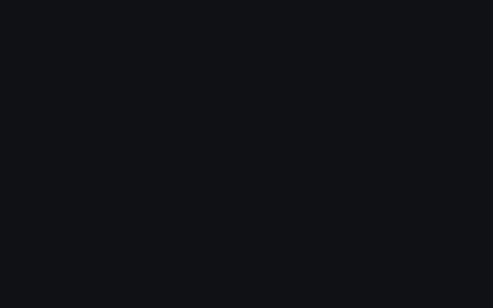
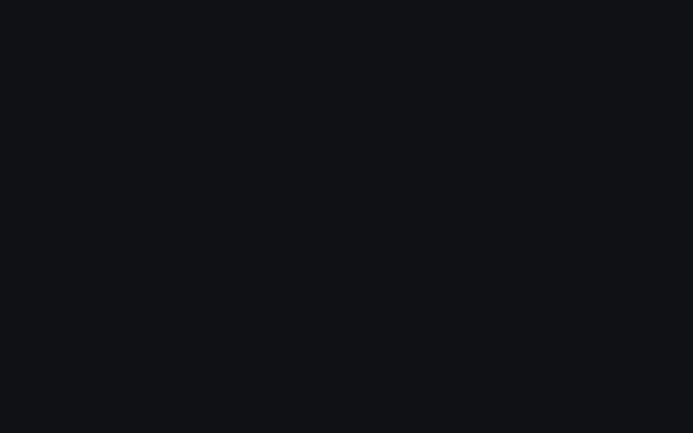
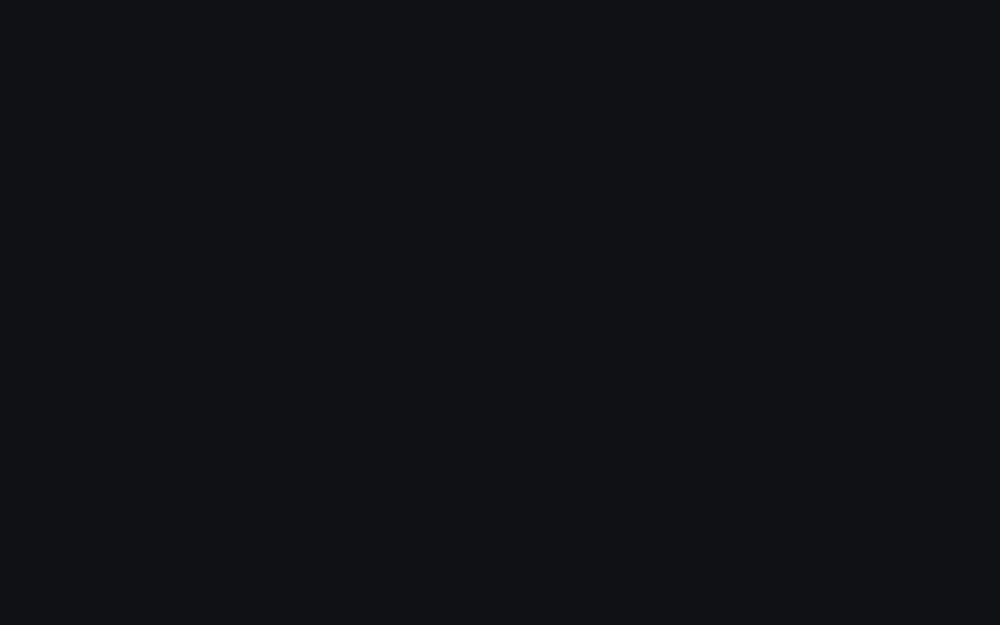
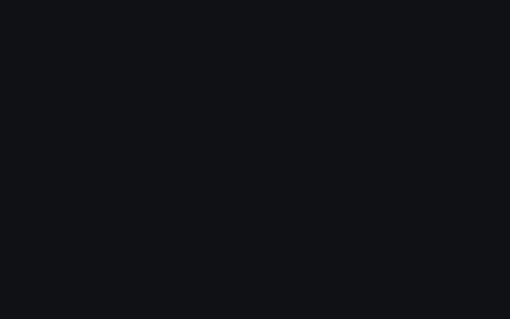

<div align="center">

# 🎚️ Pro Tools Shortcuts
### Learn · Practice · Master

**Stop reaching for the mouse.**
Every shortcut from the Avid guide: searchable, clickable, and quizzable.

[](https://mattpassionfortech.github.io/Flow-State-Audio/)
[](#-the-complete-guide)
[](#-browse--practice)


<br/>



<sub>Click any key to see every Pro Tools shortcut that uses it.</sub>

</div>

---

## Why this exists

Every engineer knows the feeling: you're mid-session, the client is watching, and you *know* there's a shortcut for what you're about to do with five mouse clicks. You just can't remember it.

Avid's shortcut guide is **90 pages of tables**. This app turns it into something you can actually *learn*: search it in a keystroke, explore it on a keyboard, and drill it until your hands know it.

No account. No install. No server. It runs in your browser and even works offline.

---

## ✨ What's inside

### ⌨️ Interactive Keyboard
A full-size keyboard where every key is labeled with its Pro Tools command. **Click any key** (letters, modifiers, even the numeric keypad) to list every shortcut in the guide that uses it. **Press a key on your real keyboard** and it lights up on screen.

Great for finding unused keys, spotting what a modifier unlocks, or just seeing the whole layout at once.

### 📚 The Complete Guide
All **933 entries across 9 chapters** of the Avid Pro Tools Shortcuts Guide (REV A, 9/2025), kept in the guide's own order and fully searchable. Collapse chapters, jump between them, and filter live as you type.



### 📖 Browse & Practice
**126 hand-picked shortcuts** for the things you do every day, organized into 8 categories: Transport, Recording, Editing, Mixing, Mastering, Navigation, MIDI, and Workflow. Filter by subcategory or difficulty (**Basic / Intermediate / Advanced**), and ⭐ the ones you want to lock in.



### 🧠 Test Yourself
Type the shortcut for each prompt. 20 questions per round, streak tracking, and an accuracy score that's saved between visits. Quiz on everything, one category, or only your favorites.



### 🎬 Workflow Scenarios
Don't just memorize keys, learn them *in sequence*. Ten step-by-step sessions walk through real tasks with the exact shortcuts and a tip at each step:

| | | |
|---|---|---|
| 🎙️ Basic Recording Session | 🎯 Punch-In Recording | ✂️ Quick Edit Workflow |
| 🏆 Comp Editing (Best Takes) | 🎛️ Mix Setup & Organization | 〰️ Automation Workflow |
| 💿 Bounce & Master Prep | 🎹 MIDI Production Flow | 🔍 Navigation & Zoom Mastery |
| 🎙️ Podcast / Voiceover Session | | |


### 🛠️ Small things that matter
- **Mac ⌘ / Windows ⊞ toggle**: auto-detects your OS, switch any time
- **`⌘K` / `Ctrl+K`** jumps straight to search
- **Favorites and quiz stats** are saved in your browser (nothing leaves your machine)
- **Dark UI** that won't blind you in a dim control room

---

## 🚀 Quick start

```bash
git clone https://github.com/MATTPASSIONFORTECH/Flow-State-Audio.git
cd Flow-State-Audio
npm install
npm run dev
```

Then open the URL Vite prints (usually `http://localhost:5173`).

### Just want to use it?
The production build is a **single self-contained HTML file**. Grab `dist/index.html` and double-click it. No server needed, and it works offline.

### Build it yourself
```bash
npm run build     # outputs dist/index.html
npm run preview   # preview the production build locally
```

---

## 🧱 Tech stack

| | |
|---|---|
| **UI** | React 19 + TypeScript |
| **Build** | Vite 7 with `vite-plugin-singlefile` (everything inlined into one HTML file) |
| **Styling** | Tailwind CSS 4 |
| **Storage** | Browser `localStorage` (favorites, quiz stats) |
| **Backend** | None |

```
src/
├── App.tsx                    # Browse, Quiz, Scenarios, Favorites + app shell
├── components/
│   ├── KeyboardView.tsx       # Interactive full-size keyboard
│   └── GuideView.tsx          # Searchable Avid guide
└── data/
    ├── shortcuts.ts           # 126 practice shortcuts + 10 scenarios
    └── pdfShortcuts.ts        # 933 entries from the Avid guide
```

---

## 🤝 Contributing

Found a shortcut that's wrong or missing? Pull requests are very welcome. Practice shortcuts are plain data in [`src/data/shortcuts.ts`](src/data/shortcuts.ts), so you don't need to touch any UI code:

```ts
{
  id: 'e30',
  keys: 'Cmd+E',
  keysMac: 'Cmd+E',
  keysWin: 'Ctrl+E',
  description: 'Your shortcut description',
  category: 'editing',          // transport | recording | editing | mixing | mastering | navigation | midi | workflow
  subcategory: 'Clip Editing',
  tags: ['search', 'keywords'],
  difficulty: 'basic',          // basic | intermediate | advanced
}
```

Ideas that would make this better:
- [ ] More workflow scenarios (mixing for post, Dolby Atmos, editing dialogue)
- [ ] Spaced-repetition mode that resurfaces the shortcuts you miss
- [ ] Printable cheat sheets per category
- [ ] Custom shortcut sets for engineers who remap their keys

---

## ⚖️ Disclaimer

This is an independent, unofficial learning tool. It is **not affiliated with, endorsed by, or sponsored by Avid Technology, Inc.** *Pro Tools* and *Avid* are trademarks or registered trademarks of Avid Technology, Inc. The guide-derived data is sourced from Avid's published *Pro Tools Shortcuts Guide*, and Avid remains the authority on it. Always check Avid's current documentation for your version of Pro Tools.

---

<div align="center">

**If this saved you a few thousand mouse clicks, drop a ⭐ and share it with the engineer in your life who still right-clicks everything.**

</div>
